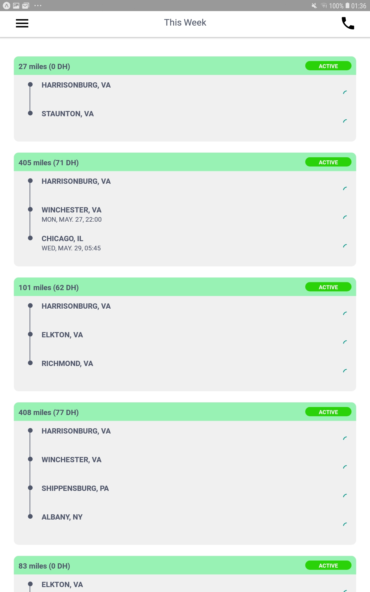
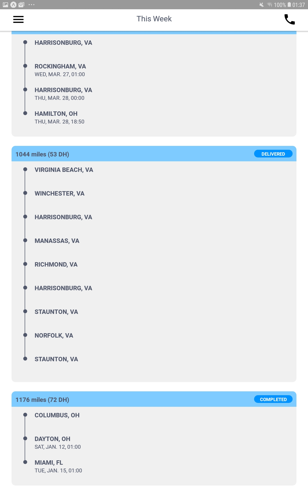
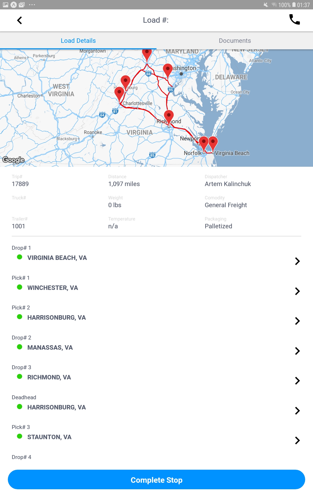
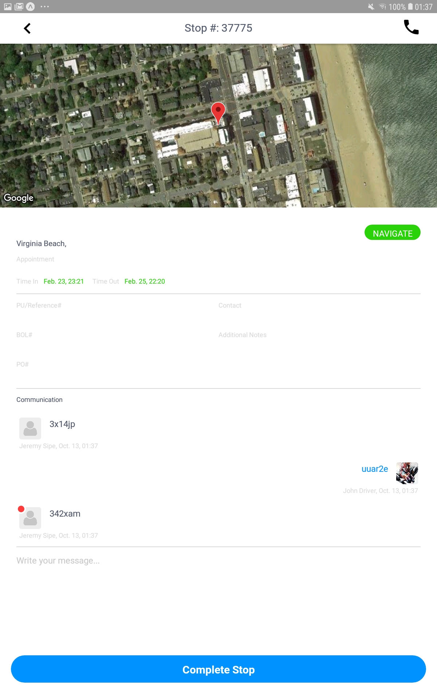
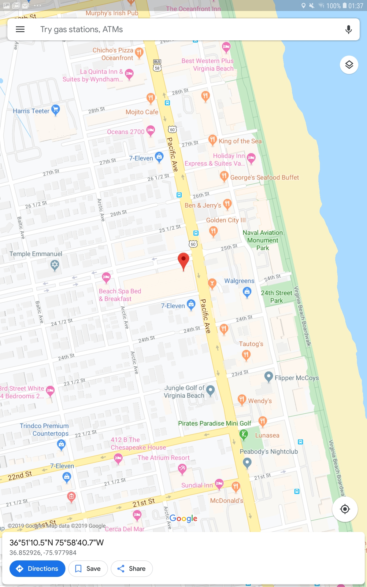
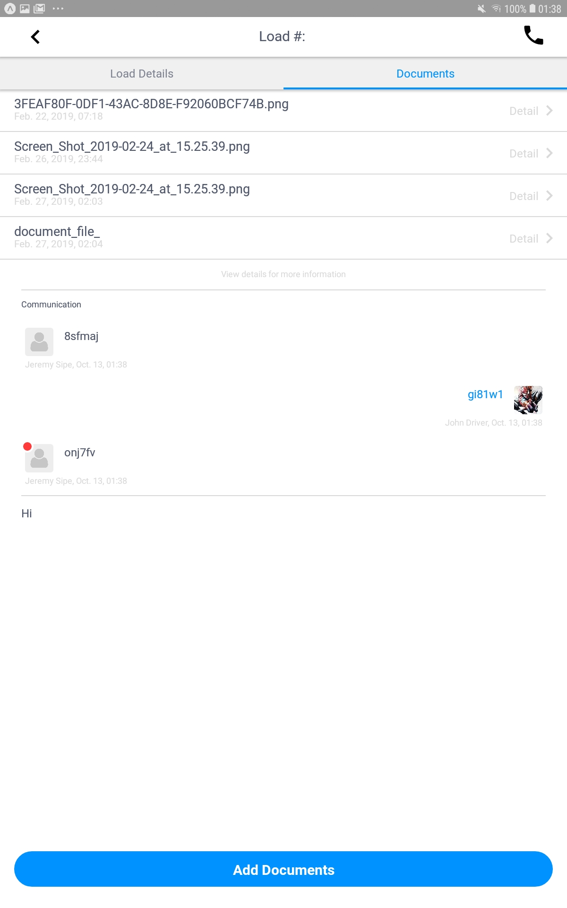

<h1 align="center"><b> Driver Booking App</b> </h1>

<h1 align="center">
   
  <kbd>
    
  </kbd>
   
    
</h1>

Have a truck and ready to take a load.? Log into your carrier app and go straight to the load board.!

<i>"How to save a life?" - The Driver Booking</i> 

  
  
  
  

  <a href="#blush-overview">Overview</a> •
  <a href="#dizzy-roadmap">Roadmap</a> •
  <a href="#wrench-install-instructions">Install</a> •
  <a href="#zap-tech-stack">Tech Stack</a> •
  <a href="#iphone-Test">Test</a> •
  <a href="#eyes-version">Version</a> •

  <kbd>
    
  </kbd>
  &nbsp;&nbsp;&nbsp;&nbsp;
  <kbd>
    
  </kbd>
  &nbsp;&nbsp;&nbsp;&nbsp;
  <kbd>
    
  </kbd>
    
  <kbd>
    
  </kbd>
    &nbsp;&nbsp;&nbsp;&nbsp;
  <kbd>
    
  </kbd>
    &nbsp;&nbsp;&nbsp;&nbsp;
  <kbd>
    
  </kbd>

## :blush: **Overview?**

LOADEMUP DRIVER - THE APP FOR CARRIERS

Use our advanced filters to sort through a multitude of loads placed by shippers and freight brokers alike.

Negotiate.! Using our platform you can counter and accept offers from shippers. You only settle on a price after both parties have ‘accepted’ it, in other words, the load is assigned after the ‘dual handshake’ is complete.

What is LoadEmUp.?
LoadEmUp is an app which connects shippers to carriers. A shipper places his load on the load board, after which a carrier can view the details of the load. The carrier can then decide whether to accept the offer or counter it with an offer of his own. The shipper and the carrier negotiate until a price has been agreed upon by both parties and the ‘dual handshake’ is complete.

After this the Load is placed in the ‘My Jobs’ page of the carrier app, and the carrier can start the load. The carrier can upload a picture of the load during pick up. Once the carrier starts the load, he can either use google maps or waze for navigation. Once a load is complete, the receiver has to sign on the app, and the carrier can upload a picture of the load on the app. After this an invoice appears and the carrier can submit, after completion of the load.

## :dizzy: **Roadmap**

-   [x] Make it work on IOS
-   [x] Make it work on Android
-   [x] Make it work on Expo
-   [x] Transform into responsive
-   [x] Update to latest React Native version

## :wrench: **Install instructions**

### Getting Started

#### 1) Clone & Install Dependencies

- 1.1) `git clone https://github.com/funnyjerry/https://github.com/funnyjerry/react-native-smoking-app.git`
- 1.2) `cd https://github.com/funnyjerry/react-native-smoking-app` - cd into your newly created project directory.
- 1.3) Install NPM packages with `yarn install`
        **Note:** NPM has issues with React Native so `yarn` is recommended over `npm`.
- 1.4) **[iOS]** `cd ios` and run `pod install` - if you don't have CocoaPods you can follow [these instructions](https://guides.cocoapods.org/using/getting-started.html#getting-started) to install it.
- 1.5) **[Android]** If you haven't already generated a `debug.keystore` file you will need to complete this step from within the `/android/app` folder. Run `keytool -genkey -v -keystore debug.keystore -storepass android -alias androiddebugkey -keypass android -keyalg RSA -keysize 2048 -validity 10000`

#### 2) Start your app

- 2.1) **[EXPO]** Build and run the iOS app, run `expo run-ios` (to run on simulator) or `expo --device` (to run on real device) from the root of your project. The first build will take some time.
## :zap: **Tech Stack**

<h1 align="center">
  
  
  
  
  

   
</h1>

-   [React Native](https://github.com/facebook/react-native)
-   [Expo](https://github.com/expo/expo)
-   [Redux](https://github.com/reduxjs/react-redux)
-   [Redux-Persist](https://github.com/rt2zz/redux-persist)
-   [Lottie React Native](https://github.com/react-native-community/lottie-react-native)
-   [Antd Mobile RN](https://github.com/ant-design/ant-design-mobile-rn)
-   [React Native Firebase](https://github.com/invertase/react-native-firebase)
-   [Eslint](https://eslint.org/)
-   [Mobx](https://github.com/mobxjs/mobx-react)

## :iphone: **Test**

- [x] Test on Android
- [x] Test on iOS

## :eyes: **Version**
- [ ] React-Native 
- [x] Expo 35